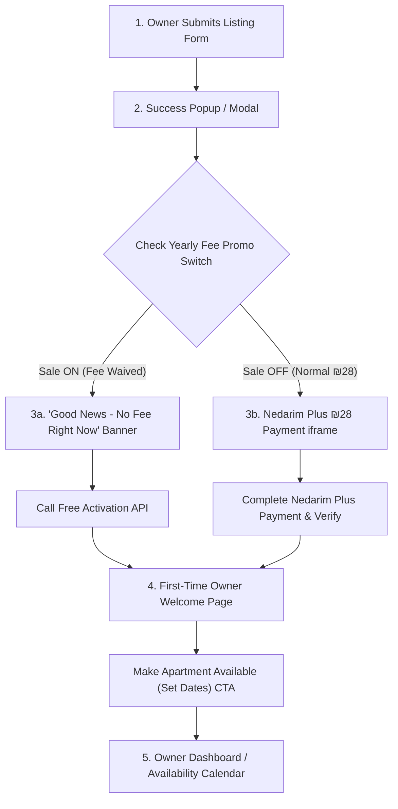

# ShabbosRent — First-Time Owner Flow & Payment Integration Guide
> **Part D · Item 12: First-Time Owner Flow and Payments**  
> **Status:** Architecture & Frontend/Backend Implementation Spec  
> **Currency:** ILS (₪) · **Default Yearly Fee:** ₪28/year

---

## 1. Executive Summary & Flow Architecture

### Current Problem (Wrong Order)
- Previously, submitting an apartment redirected the user straight into the dashboard without payment or onboarding.
- Nedarim Plus payment was disconnected from the initial listing flow.

### Correct Order & Flow


---

## 2. Step-by-Step UX Breakdown

| Step | Page / Component | Key Actions & State |
| :--- | :--- | :--- |
| **Step 1** | `/list-apartment` | Owner fills details, uploads images, and clicks **Submit Listing**. Creates apartment with status `PENDING`. |
| **Step 2** | `ListingSuccessModal` | Pop-up modal: *"Listing Created Successfully! Next: Activate your listing for 1 year."* Clicks **Proceed to Activation**. |
| **Step 3A (Sale ON)** | `/apartment/[id]/payment` | Shows **"Good news - no fee right now! 🎉"**. Owner clicks **"Activate My Listing for Free"**. Listing is marked valid for 365 days with status `CONFIRMED`. |
| **Step 3B (Sale OFF)** | `/apartment/[id]/payment` | Shows **₪28/year Yearly Fee** with embedded Nedarim Plus iframe. Upon card confirmation, backend verifies and marks `CONFIRMED` with 365 days expiry. |
| **Step 4** | `/owner/welcome?apartmentId=...` | **First-Time Owner Welcome Page**. Welcomes the owner, highlights dashboard tools, and specifically reminds them to **make their apartment available by setting dates**. |
| **Step 5** | `/owner/dashboard` or Date Modal | Owner sets their first Shabbat/weekend dates so renters can find and book their apartment. |

---

## 3. Two New Features Specification

### Feature (a): Admin Dashboard "Yearly Fee ON SALE" Switch
- **Purpose:** Allows Admin to run zero-fee promotions. When ON, all new and renewing listing fees are waived.
- **Admin Switch Location:** Admin Settings / Fees section.
- **Frontend Behavior:**
  - When ON: The payment screen renders a promotional card: *"Good news - no fee right now!"* and a one-click **"Continue & Activate"** button (no credit card or iframe required).
  - When OFF: Renders standard ₪28 Nedarim Plus checkout.
- **Backend Behavior:**
  - Admin endpoint: `PATCH /api/v1/admin/settings/yearly-fee-sale` (`{ isOnSale: boolean }`).
  - Public/User endpoint: `GET /api/v1/payment/listing-fee-status` (`{ amount: 28, isOnSale: boolean, effectiveAmount: 0 | 28 }`).
  - Activation endpoint: `POST /api/v1/payment/activate-free-listing` (`{ apartmentId: string }`) — only succeeds if `isOnSale === true`. Creates a ₪0 payment record with status `CONFIRMED`, `expiresAt = now + 365 days`, and activates apartment.

---

### Feature (b): First-Time Owner Welcome Page
- **Purpose:** Provide onboarding guidance so new owners don't leave their listing hidden or unavailable.
- **Key Content:**
  1. **Congratulations & Listing Confirmation:** Confirmation badge with Property ID (e.g. `apart-042`).
  2. **Dashboard Overview:** Quick tour of:
     - 📅 **Availability Calendar** (Managing Shabbatot)
     - 📩 **Rent & Swap Requests** (Incoming inquiries)
     - 📊 **Listing Stats** (Views and inquiries)
  3. **Crucial Call-to-Action (Action Item):**
     - Banner: *"Important: Your apartment is not visible to renters until you make it available for upcoming Shabbatot!"*
     - Button: **"Set Available Dates Now →"** (Opens weekend calendar selector).
     - Secondary link: *"Go to Dashboard Overview"*.

---

## 4. Next.js Frontend Implementation

### 4.1 API Client Layer (`src/lib/payment/listingFlowApi.ts`)

```typescript
import axios from 'axios';

const API_BASE = process.env.NEXT_PUBLIC_API_URL || 'https://api.shabbosrent.com';

export interface ListingFeeStatus {
  standardFee: number;
  isOnSale: boolean;
  effectiveFee: number;
  currency: string;
}

export interface FreeActivationResponse {
  success: boolean;
  message: string;
  apartmentId: string;
  expiresAt: string;
}

// 1. Fetch current sale status & fee
export const getListingFeeStatus = async (token: string): Promise<ListingFeeStatus> => {
  const res = await axios.get(`${API_BASE}/api/v1/payment/listing-fee-status`, {
    headers: { Authorization: `Bearer ${token}` }
  });
  return res.data.data;
};

// 2. Activate free listing when promo is ON
export const activateFreeListing = async (
  apartmentId: string,
  token: string
): Promise<FreeActivationResponse> => {
  const res = await axios.post(
    `${API_BASE}/api/v1/payment/activate-free-listing`,
    { apartmentId },
    { headers: { Authorization: `Bearer ${token}` } }
  );
  return res.data.data;
};

// 3. Admin: Toggle sale switch
export const toggleAdminYearlyFeeSale = async (
  isOnSale: boolean,
  token: string
): Promise<{ isOnSale: boolean }> => {
  const res = await axios.patch(
    `${API_BASE}/api/v1/admin/settings/yearly-fee-sale`,
    { isOnSale },
    { headers: { Authorization: `Bearer ${token}` } }
  );
  return res.data.data;
};
```

---

### 4.2 Step 2: Listing Success Modal (`src/components/apartment/ListingSuccessModal.tsx`)

```tsx
'use client';

import React from 'react';
import { useRouter } from 'next/navigation';
import { CheckCircle2, ArrowRight } from 'lucide-react';

interface ListingSuccessModalProps {
  isOpen: boolean;
  apartmentId: string;
  propertyTitle: string;
  propertyId?: string;
}

export const ListingSuccessModal: React.FC<ListingSuccessModalProps> = ({
  isOpen,
  apartmentId,
  propertyTitle,
  propertyId,
}) => {
  const router = useRouter();

  if (!isOpen) return null;

  const handleProceed = () => {
    router.push(`/apartment/${apartmentId}/activate`);
  };

  return (
    <div className="fixed inset-0 z-50 flex items-center justify-center bg-black/60 backdrop-blur-sm p-4">
      <div className="w-full max-w-md bg-white rounded-2xl shadow-2xl p-6 text-center animate-in fade-in zoom-in duration-200">
        <div className="w-16 h-16 bg-emerald-100 text-emerald-600 rounded-full flex items-center justify-center mx-auto mb-4">
          <CheckCircle2 className="w-10 h-10" />
        </div>

        <h2 className="text-2xl font-bold text-gray-900 mb-1">
          Listing Submitted!
        </h2>
        {propertyId && (
          <span className="inline-block px-3 py-1 bg-gray-100 text-gray-700 text-xs font-semibold rounded-full mb-3">
            ID: {propertyId}
          </span>
        )}

        <p className="text-gray-600 text-sm mb-6 leading-relaxed">
          Your property <span className="font-semibold text-gray-800">"{propertyTitle}"</span> has been created.
          Complete the final activation step to publish it and receive bookings.
        </p>

        <button
          onClick={handleProceed}
          className="w-full flex items-center justify-center gap-2 bg-blue-600 hover:bg-blue-700 text-white font-semibold py-3 px-6 rounded-xl transition duration-150 shadow-md hover:shadow-lg"
        >
          <span>Proceed to Activation</span>
          <ArrowRight className="w-4 h-4" />
        </button>
      </div>
    </div>
  );
};
```

---

### 4.3 Step 3: Activation & Payment Page (`src/app/apartment/[id]/activate/page.tsx`)

```tsx
'use client';

import React, { useEffect, useState } from 'react';
import { useParams, useRouter } from 'next/navigation';
import { getListingFeeStatus, activateFreeListing, ListingFeeStatus } from '@/lib/payment/listingFlowApi';
import { useListingPayment } from '@/hooks/useListingPayment';
import { NedarimPaymentModal } from '@/components/payment/NedarimPaymentModal';
import { Sparkles, ShieldCheck, CheckCircle, ArrowRight, Loader2 } from 'lucide-react';

export default function ApartmentActivationPage() {
  const { id: apartmentId } = useParams() as { id: string };
  const router = useRouter();
  const token = typeof window !== 'undefined' ? localStorage.getItem('token') || '' : '';

  const [feeStatus, setFeeStatus] = useState<ListingFeeStatus | null>(null);
  const [loading, setLoading] = useState(true);
  const [activatingFree, setActivatingFree] = useState(false);
  const [showPaidModal, setShowPaidModal] = useState(false);

  const {
    intent,
    isLoading: isIntentLoading,
    createIntent,
    verifyPayment,
  } = useListingPayment();

  useEffect(() => {
    async function loadStatus() {
      try {
        const data = await getListingFeeStatus(token);
        setFeeStatus(data);
      } catch (err) {
        console.error('Failed to load fee status:', err);
      } finally {
        setLoading(false);
      }
    }
    if (token) loadStatus();
  }, [token]);

  const handleFreeActivation = async () => {
    try {
      setActivatingFree(true);
      await activateFreeListing(apartmentId, token);
      router.push(`/owner/welcome?apartmentId=${apartmentId}`);
    } catch (err: any) {
      alert(err?.response?.data?.message || 'Failed to activate listing.');
    } finally {
      setActivatingFree(false);
    }
  };

  const handlePaidFlow = async () => {
    const success = await createIntent(apartmentId);
    if (success) {
      setShowPaidModal(true);
    }
  };

  const handlePaymentSuccess = () => {
    setShowPaidModal(false);
    router.push(`/owner/welcome?apartmentId=${apartmentId}`);
  };

  if (loading) {
    return (
      <div className="min-h-screen flex items-center justify-center bg-gray-50">
        <Loader2 className="w-8 h-8 animate-spin text-blue-600" />
      </div>
    );
  }

  return (
    <div className="min-h-screen bg-gradient-to-b from-blue-50/50 to-white flex items-center justify-center p-4">
      <div className="w-full max-w-lg bg-white rounded-3xl shadow-xl border border-gray-100 p-8">
        
        {/* Header */}
        <div className="text-center mb-8">
          <div className="inline-flex items-center gap-2 px-3 py-1.5 bg-blue-50 text-blue-700 text-xs font-semibold rounded-full mb-3">
            <ShieldCheck className="w-4 h-4" />
            1-Year Active Listing Pass
          </div>
          <h1 className="text-3xl font-extrabold text-gray-900">
            Activate Your Listing
          </h1>
          <p className="text-gray-500 text-sm mt-2">
            Get your apartment published for 365 days of booking requests.
          </p>
        </div>

        {/* PROMO: Fee On Sale */}
        {feeStatus?.isOnSale ? (
          <div className="bg-gradient-to-br from-emerald-50 to-teal-50 border border-emerald-200 rounded-2xl p-6 text-center mb-8">
            <div className="inline-flex p-3 bg-emerald-500 text-white rounded-2xl mb-3 shadow-md">
              <Sparkles className="w-6 h-6" />
            </div>
            <h2 className="text-xl font-bold text-emerald-900 mb-1">
              Good news — no fee right now! 🎉
            </h2>
            <p className="text-emerald-700 text-sm mb-4">
              The standard yearly fee (₪28) is waived during our promotional period.
            </p>
            <div className="flex items-center justify-center gap-2 text-2xl font-black text-emerald-900">
              <span className="line-through text-gray-400 text-lg font-normal">₪28</span>
              <span>₪0</span>
              <span className="text-xs font-medium text-emerald-600">/ 1st Year</span>
            </div>

            <button
              onClick={handleFreeActivation}
              disabled={activatingFree}
              className="mt-6 w-full flex items-center justify-center gap-2 bg-emerald-600 hover:bg-emerald-700 text-white font-bold py-3.5 px-6 rounded-xl transition duration-150 shadow-md hover:shadow-lg disabled:opacity-50"
            >
              {activatingFree ? (
                <Loader2 className="w-5 h-5 animate-spin" />
              ) : (
                <>
                  <span>Activate My Listing for Free</span>
                  <ArrowRight className="w-4 h-4" />
                </>
              )}
            </button>
          </div>
        ) : (
          /* REGULAR: ₪28 Nedarim Plus payment */
          <div className="bg-gray-50 border border-gray-200 rounded-2xl p-6 text-center mb-8">
            <h2 className="text-xl font-bold text-gray-900 mb-1">
              Yearly Listing Fee
            </h2>
            <p className="text-gray-600 text-sm mb-4">
              Secure 1 full year of verified listing visibility.
            </p>
            <div className="text-4xl font-black text-gray-900 mb-6">
              ₪28 <span className="text-xs font-semibold text-gray-500">/ Year</span>
            </div>

            <ul className="text-left text-sm text-gray-600 space-y-2.5 mb-6 px-4">
              <li className="flex items-center gap-2">
                <CheckCircle className="w-4 h-4 text-emerald-500 flex-shrink-0" />
                <span>Publish unlimited Shabbat availability</span>
              </li>
              <li className="flex items-center gap-2">
                <CheckCircle className="w-4 h-4 text-emerald-500 flex-shrink-0" />
                <span>Receive verified renter contact requests</span>
              </li>
              <li className="flex items-center gap-2">
                <CheckCircle className="w-4 h-4 text-emerald-500 flex-shrink-0" />
                <span>Full access to Apartment Swap feature</span>
              </li>
            </ul>

            <button
              onClick={handlePaidFlow}
              disabled={isIntentLoading}
              className="w-full flex items-center justify-center gap-2 bg-blue-600 hover:bg-blue-700 text-white font-bold py-3.5 px-6 rounded-xl transition duration-150 shadow-md hover:shadow-lg disabled:opacity-50"
            >
              {isIntentLoading ? (
                <Loader2 className="w-5 h-5 animate-spin" />
              ) : (
                <>
                  <span>Pay ₪28 via Nedarim Plus</span>
                  <ArrowRight className="w-4 h-4" />
                </>
              )}
            </button>
          </div>
        )}

        {/* Nedarim Modal (for Paid Flow) */}
        {showPaidModal && intent && (
          <NedarimPaymentModal
            isOpen={showPaidModal}
            onClose={() => setShowPaidModal(false)}
            onSuccess={handlePaymentSuccess}
            onVerify={verifyPayment}
            intent={intent}
          />
        )}

        <div className="text-center text-xs text-gray-400">
          🔒 Secure 256-bit SSL encrypted verification via Nedarim Plus.
        </div>
      </div>
    </div>
  );
}
```

---

### 4.4 Step 4: First-Time Owner Welcome Page (`src/app/owner/welcome/page.tsx`)

```tsx
'use client';

import React from 'react';
import { useSearchParams, useRouter } from 'next/navigation';
import {
  CalendarDays,
  Inbox,
  ArrowRight,
  Sparkles,
  Sliders,
  CalendarCheck
} from 'lucide-react';

export default function FirstTimeOwnerWelcomePage() {
  const router = useRouter();
  const searchParams = useSearchParams();
  const apartmentId = searchParams.get('apartmentId');

  const handleSetDates = () => {
    if (apartmentId) {
      router.push(`/owner/dashboard?tab=calendar&apartmentId=${apartmentId}`);
    } else {
      router.push('/owner/dashboard?tab=calendar');
    }
  };

  const handleGoDashboard = () => {
    router.push('/owner/dashboard');
  };

  return (
    <div className="min-h-screen bg-slate-50 flex items-center justify-center p-4">
      <div className="w-full max-w-2xl bg-white rounded-3xl shadow-xl border border-slate-100 p-8 md:p-10">
        
        {/* Welcome Header */}
        <div className="text-center mb-8">
          <div className="w-16 h-16 bg-blue-100 text-blue-600 rounded-full flex items-center justify-center mx-auto mb-4">
            <Sparkles className="w-8 h-8" />
          </div>
          <h1 className="text-3xl font-black text-slate-900 tracking-tight">
            Welcome to ShabbosRent!
          </h1>
          <p className="text-slate-600 text-base mt-2">
            Your apartment listing is now confirmed and ready.
          </p>
        </div>

        {/* CRITICAL CALLOUT: Make Available (Set Dates) */}
        <div className="bg-amber-50 border-2 border-amber-300 rounded-2xl p-6 mb-8 relative overflow-hidden">
          <div className="flex items-start gap-4">
            <div className="p-3 bg-amber-500 text-white rounded-xl flex-shrink-0">
              <CalendarDays className="w-6 h-6" />
            </div>
            <div>
              <h2 className="text-lg font-bold text-amber-900 mb-1">
                Important: Make Your Apartment Available
              </h2>
              <p className="text-amber-800 text-sm leading-relaxed mb-4">
                To start receiving inquiries and swap matches, you must select the Shabbatot/weekends your apartment is available for rent.
              </p>
              <button
                onClick={handleSetDates}
                className="inline-flex items-center gap-2 bg-amber-600 hover:bg-amber-700 text-white font-bold text-sm py-2.5 px-5 rounded-xl transition duration-150 shadow hover:shadow-md"
              >
                <span>Set Available Dates Now</span>
                <ArrowRight className="w-4 h-4" />
              </button>
            </div>
          </div>
        </div>

        {/* Dashboard Feature Highlights */}
        <h3 className="text-xs font-bold uppercase tracking-wider text-slate-400 mb-4">
          What you can do in your Dashboard:
        </h3>
        
        <div className="grid grid-cols-1 md:grid-cols-3 gap-4 mb-8">
          <div className="p-4 bg-slate-50 border border-slate-100 rounded-xl">
            <CalendarCheck className="w-5 h-5 text-blue-600 mb-2" />
            <h4 className="font-semibold text-slate-800 text-sm">Manage Dates</h4>
            <p className="text-xs text-slate-500 mt-1">Open or close specific Shabbatot with one click.</p>
          </div>

          <div className="p-4 bg-slate-50 border border-slate-100 rounded-xl">
            <Inbox className="w-5 h-5 text-emerald-600 mb-2" />
            <h4 className="font-semibold text-slate-800 text-sm">Rent Requests</h4>
            <p className="text-xs text-slate-500 mt-1">Review renter profiles and accept contact inquiries.</p>
          </div>

          <div className="p-4 bg-slate-50 border border-slate-100 rounded-xl">
            <Sliders className="w-5 h-5 text-purple-600 mb-2" />
            <h4 className="font-semibold text-slate-800 text-sm">Apartment Swap</h4>
            <p className="text-xs text-slate-500 mt-1">Swap your home with other owners across Israel.</p>
          </div>
        </div>

        {/* Footer Actions */}
        <div className="flex flex-col sm:flex-row items-center justify-between gap-4 pt-4 border-t border-slate-100">
          <button
            onClick={handleGoDashboard}
            className="text-sm font-semibold text-slate-500 hover:text-slate-800 transition"
          >
            Skip to Dashboard Overview →
          </button>

          <button
            onClick={handleSetDates}
            className="w-full sm:w-auto inline-flex items-center justify-center gap-2 bg-slate-900 hover:bg-slate-800 text-white font-bold py-3 px-6 rounded-xl transition"
          >
            <span>Go to Calendar</span>
            <ArrowRight className="w-4 h-4" />
          </button>
        </div>

      </div>
    </div>
  );
}
```

---

### 4.5 Feature (a) Admin Dashboard Switch (`src/components/admin/YearlyFeeSaleToggle.tsx`)

```tsx
'use client';

import React, { useState } from 'react';
import { toggleAdminYearlyFeeSale } from '@/lib/payment/listingFlowApi';
import { Tag, Sparkles } from 'lucide-react';

interface YearlyFeeSaleToggleProps {
  initialStatus: boolean;
  token: string;
}

export const YearlyFeeSaleToggle: React.FC<YearlyFeeSaleToggleProps> = ({
  initialStatus,
  token,
}) => {
  const [isOnSale, setIsOnSale] = useState(initialStatus);
  const [loading, setLoading] = useState(false);

  const handleToggle = async () => {
    try {
      setLoading(true);
      const newStatus = !isOnSale;
      await toggleAdminYearlyFeeSale(newStatus, token);
      setIsOnSale(newStatus);
    } catch (err) {
      alert('Failed to update promotion status');
    } finally {
      setLoading(false);
    }
  };

  return (
    <div className="p-6 bg-white rounded-2xl border border-gray-200 shadow-sm flex items-center justify-between">
      <div className="flex items-center gap-4">
        <div className={`p-3 rounded-xl ${isOnSale ? 'bg-emerald-100 text-emerald-600' : 'bg-gray-100 text-gray-500'}`}>
          <Tag className="w-6 h-6" />
        </div>
        <div>
          <div className="flex items-center gap-2">
            <h3 className="text-base font-bold text-gray-900">
              Yearly Listing Fee Promotion (ON SALE)
            </h3>
            {isOnSale && (
              <span className="inline-flex items-center gap-1 px-2.5 py-0.5 bg-emerald-100 text-emerald-700 text-xs font-bold rounded-full">
                <Sparkles className="w-3 h-3" /> ACTIVE PROMO (FREE)
              </span>
            )}
          </div>
          <p className="text-sm text-gray-500 mt-0.5">
            When ON, first-time owners and renewing listings pay ₪0 and can activate instantly.
          </p>
        </div>
      </div>

      <button
        onClick={handleToggle}
        disabled={loading}
        className={`relative inline-flex h-7 w-12 flex-shrink-0 cursor-pointer rounded-full border-2 border-transparent transition-colors duration-200 ease-in-out focus:outline-none ${
          isOnSale ? 'bg-emerald-600' : 'bg-gray-300'
        } disabled:opacity-50`}
      >
        <span
          className={`pointer-events-none inline-block h-6 w-6 transform rounded-full bg-white shadow ring-0 transition duration-200 ease-in-out ${
            isOnSale ? 'translate-x-5' : 'translate-x-0'
          }`}
        />
      </button>
    </div>
  );
};
```

---

## 5. Backend Implementation Spec

```typescript
// src/app/modules/payment/payment.service.ts
let isYearlyFeeOnSale = false;

export const getListingFeeStatusService = async () => {
  const standardFee = Number(process.env.LISTING_FEE) || 28;
  return {
    standardFee,
    isOnSale: isYearlyFeeOnSale,
    effectiveFee: isYearlyFeeOnSale ? 0 : standardFee,
    currency: "ILS",
  };
};

export const setYearlyFeeSaleService = async (isOnSale: boolean) => {
  isYearlyFeeOnSale = Boolean(isOnSale);
  return { isOnSale: isYearlyFeeOnSale };
};

export const activateFreeListingService = async (userId: string, apartmentId: string) => {
  if (!isYearlyFeeOnSale) {
    throw new ApiError(StatusCodes.FORBIDDEN, "Yearly fee promotion is not currently active");
  }

  const apartment = await prisma.apartment.findFirst({
    where: { id: apartmentId, userId },
  });

  if (!apartment) {
    throw new ApiError(StatusCodes.NOT_FOUND, "Apartment not found or unauthorized");
  }

  const now = new Date();
  const expiresAt = new Date(now.getTime() + 365 * 24 * 60 * 60 * 1000);

  // Upsert free payment record & activate apartment
  await prisma.$transaction([
    prisma.apartmentListingPayment.upsert({
      where: { apartmentId },
      create: {
        apartmentId,
        userId,
        amount: 0,
        currency: "ILS",
        paymentMethod: "NEDARIM_PLUS",
        transactionId: `PROMO-FREE-${Date.now()}-${apartmentId.slice(0, 6)}`,
        status: "CONFIRMED",
        paidAt: now,
        expiresAt,
      },
      update: {
        amount: 0,
        status: "CONFIRMED",
        paidAt: now,
        expiresAt,
      },
    }),
    prisma.apartment.update({
      where: { id: apartmentId },
      data: {
        status: "CONFIRMED",
        isActive: true,
      },
    }),
  ]);

  return {
    success: true,
    message: "Listing activated successfully under free promotion",
    apartmentId,
    expiresAt,
  };
};
```

---

## 6. Summary Checklist for QA & Verification

- [ ] **Step 1:** Submitting `/list-apartment` opens `ListingSuccessModal` with Property ID.
- [ ] **Step 2:** Clicking modal CTA navigates to `/apartment/[id]/activate`.
- [ ] **Step 3 (Sale ON):** Admin toggles sale ON → user sees *"Good news - no fee right now"*, clicks free activation → status becomes `CONFIRMED`, `expiresAt` set to +365 days.
- [ ] **Step 3 (Sale OFF):** Admin toggles sale OFF → user sees ₪28 Nedarim Plus iframe, completes payment → status becomes `CONFIRMED`.
- [ ] **Step 4:** User is redirected to `/owner/welcome`.
- [ ] **Step 5:** Welcome page prompts user to **Make Apartment Available** and links to calendar date selector.
