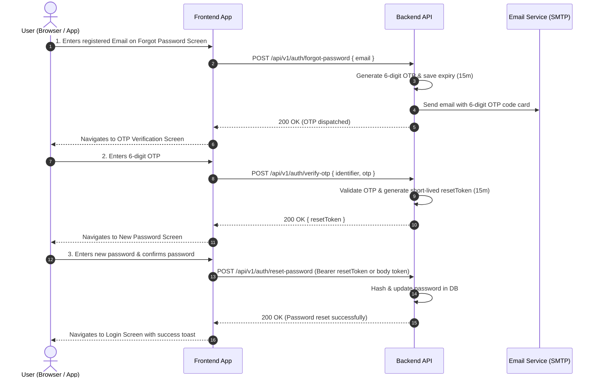

# Password Reset (OTP Flow) Integration Guide

This guide documents the complete 3-step **OTP-based password recovery flow** for **Shabbos Rent**. No website link / URL tokens are sent in the email; instead, the user receives a 6-digit numeric OTP code to enter on the frontend.

---

## 1. Flow Overview



---

## 2. API Endpoints Summary

| Step | Action | Method | Endpoint | Auth / Token | Content-Type |
|---|---|---|---|---|---|
| **1** | **Request OTP Code** | `POST` | `/api/v1/auth/forgot-password` | None (Public) | `application/json` |
| **2** | **Verify OTP Code** | `POST` | `/api/v1/auth/verify-otp` | None (Public) | `application/json` |
| **3** | **Set New Password** | `POST` | `/api/v1/auth/reset-password` | `resetToken` | `application/json` |
| *Alt* | **Resend OTP Code** | `POST` | `/api/v1/auth/resend-otp` | None (Public) | `application/json` |

---

## 3. Step-by-Step API Specification

### Step 1: Request Password Reset OTP

Initiates the password reset process. The backend generates a 6-digit numerical OTP (valid for 15 minutes) and delivers it to the user's email.

- **Endpoint**: `/api/v1/auth/forgot-password`
- **Method**: `POST`
- **Access**: Public
- **Headers**:
  ```http
  Content-Type: application/json
  ```

#### Request Payload
| Field | Type | Required | Description |
|---|---|---|---|
| `email` | `string` | Yes (or `identifier`) | The user's registered email address |
| `identifier` | `string` | Optional | Alternative field for email or phone |

```json
{
  "email": "user@example.com"
}
```

#### Success Response (`200 OK`)
```json
{
  "statusCode": 200,
  "success": true,
  "message": "Password reset OTP generated and stored successfully",
  "data": {
    "message": "Password reset OTP sent successfully",
    "email": "user@example.com"
  }
}
```

#### Error Responses
- **`400 Bad Request`**: Missing email or invalid email format.
  ```json
  {
    "success": false,
    "message": "Email or identifier is required"
  }
  ```
- **`404 Not Found`**: No account found with the provided email.
  ```json
  {
    "success": false,
    "message": "User not found with this email or phone number"
  }
  ```
- **`503 Service Unavailable`**: Email provider connection failure.
  ```json
  {
    "success": false,
    "message": "Unable to send reset password OTP email at this moment. Please try again later."
  }
  ```

---

### Step 2: Verify 6-Digit OTP

Verifies the 6-digit OTP code entered by the user. On successful verification, the backend issues a temporary `resetToken` (valid for 15 minutes) used to authorize the password change in Step 3.

- **Endpoint**: `/api/v1/auth/verify-otp`
- **Method**: `POST`
- **Access**: Public
- **Headers**:
  ```http
  Content-Type: application/json
  ```

#### Request Payload
| Field | Type | Required | Description |
|---|---|---|---|
| `identifier` | `string` | Yes | The email address or phone number from Step 1 |
| `otp` | `number \| string` | Yes | The 6-digit numeric OTP received in email (e.g. `123456` or `"123456"`) |

```json
{
  "identifier": "user@example.com",
  "otp": 583921
}
```

#### Success Response (`200 OK`)
```json
{
  "statusCode": 200,
  "success": true,
  "message": "OTP verified successfully",
  "data": {
    "message": "OTP verified successfully",
    "resetToken": "eyJhbGciOiJIUzI1NiIsInR5cCI6IkpXVCJ9..."
  }
}
```

#### Error Responses
- **`400 Bad Request` (Invalid OTP)**:
  ```json
  {
    "success": false,
    "message": "Invalid OTP"
  }
  ```
- **`400 Bad Request` (Expired OTP)**:
  ```json
  {
    "success": false,
    "message": "OTP has expired. Please request a new code."
  }
  ```

---

### Step 3: Set New Password

Resets the user's password. The request must include the `resetToken` received from Step 2.

- **Endpoint**: `/api/v1/auth/reset-password`
- **Method**: `POST`
- **Access**: Authorized with `resetToken`
- **Passing the `resetToken`** *(choose any one option)*:
  1. `Authorization: Bearer <resetToken>` header *(Recommended)*
  2. In request body: `{ "token": "<resetToken>", ... }`
  3. In URL query: `?token=<resetToken>`
- **Headers**:
  ```http
  Content-Type: application/json
  Authorization: Bearer <resetToken>
  ```

#### Request Payload
| Field | Type | Required | Description |
|---|---|---|---|
| `newPassword` | `string` | Yes | New password (minimum 6 characters) |
| `confirmNewPassword` | `string` | Yes | Must match `newPassword` |
| `token` | `string` | Optional | `resetToken` if not sent in `Authorization` header |

```json
{
  "newPassword": "NewSecurePassword123!",
  "confirmNewPassword": "NewSecurePassword123!"
}
```

#### Success Response (`200 OK`)
```json
{
  "statusCode": 200,
  "success": true,
  "message": "Password reset successfully",
  "data": {
    "message": "Password reset successfully"
  }
}
```

#### Error Responses
- **`400 Bad Request`**: Passwords do not match or password is too short.
  ```json
  {
    "success": false,
    "message": "Passwords do not match"
  }
  ```
- **`401 Unauthorized`**: Missing, invalid, or expired reset token.
  ```json
  {
    "success": false,
    "message": "Invalid or expired password reset token"
  }
  ```

---

### Step 4 (Optional): Resend OTP Code

If the user did not receive the OTP or it expired, they can request a new one.

- **Endpoint**: `/api/v1/auth/resend-otp`
- **Method**: `POST`
- **Access**: Public
- **Headers**:
  ```http
  Content-Type: application/json
  ```

#### Request Payload
```json
{
  "identifier": "user@example.com"
}
```

#### Success Response (`200 OK`)
```json
{
  "statusCode": 200,
  "success": true,
  "message": "OTP resent successfully",
  "data": {
    "message": "OTP resent successfully"
  }
}
```

---

## 4. Key Security & Implementation Rules

1. **Numeric 6-Digit OTP**: Generated dynamically and stored with a 15-minute expiration timestamp.
2. **OTP Invalidation**: As soon as the OTP is verified or expired, it is invalidated in the database.
3. **Reset Token Lifecycle**: `verify-otp` produces a signed JWT `resetToken` with a 15-minute TTL to ensure the user cannot reset a password without first proving OTP ownership.
4. **Clean Email Styling**: The OTP email is dispatched with high deliverability headers and plain text fallback without triggering spam filters.
