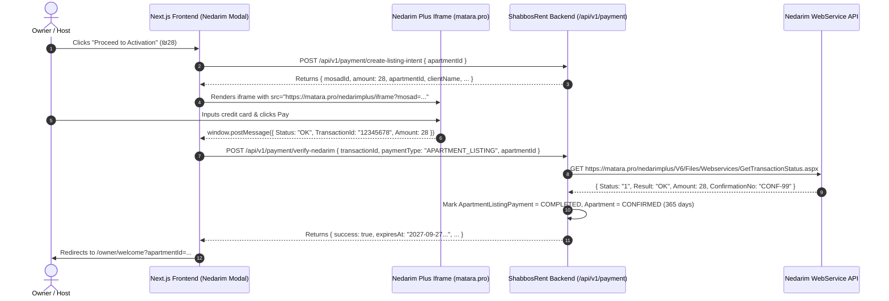

# Nedarim Plus Payment Integration Guide & Iframe Fix
> **Dedicated Guide:** Nedarim Plus Iframe Embedding, Error Analysis, API Contracts, PostMessage Handling, and Frontend Code.

---

## 1. Why the Nedarim Payment Form Was Not Loading

### The Error
```text
(index):1 Refused to display 'https://matara.pro/' in a frame because it set 'X-Frame-Options' to 'sameorigin'.
```

### Identification & Explanation
1. **The Problem:** The frontend component was embedding `https://matara.pro/` (the root website homepage) directly into the `<iframe>` `src`.
2. **Security Constraint:** The server at `matara.pro` sets `X-Frame-Options: SAMEORIGIN` on its main portal to prevent clickjacking attacks on its public website.
3. **The Solution:** Nedarim Plus requires using their dedicated iframe checkout endpoint with the merchant parameters (`Mosad`, `Amount`, `ClientName`, `Param1`, etc.), or using their client JavaScript SDK.

---

## 2. Correct Nedarim Plus Iframe Endpoint

### URL Structure
```text
https://matara.pro/nedarimplus/iframe?mosad={MOSAD_ID}&Amount={AMOUNT}&ClientName={CLIENT_NAME}&Mail={EMAIL}&Phone={PHONE}&Currency=1&Param1={APARTMENT_ID}
```
*(Alternative standard checkout URL: `https://matara.pro/nedarimplus/online.aspx?mosad={MOSAD_ID}`)*

### Query Parameters Explained

| Parameter | Type | Required | Description | Example |
| :--- | :--- | :--- | :--- | :--- |
| `mosad` | String / Number | **Yes** | Your Nedarim Plus Institution (Mosad) ID | `7001234` |
| `Amount` | Number | **Yes** | Transaction amount in Shekels (ILS) | `28` |
| `Currency` | Number | **Yes** | `1` for ILS (Israeli Shekel), `2` for USD | `1` |
| `ClientName` | String (Encoded) | Optional | Full name of the listing owner | `David%20Cohen` |
| `Mail` | String (Encoded) | Optional | Email address for invoice receipt | `david%40example.com` |
| `Phone` | String (Encoded) | Optional | Contact phone number | `0501234567` |
| `Param1` | String | Recommended | Custom identifier (e.g. `apartmentId` or `paymentId`) | `c6a6f1d2-38b4-467a-a63e-908316274029` |
| `Tashloumim` | Number | Optional | Max installment payments allowed (default `1`) | `1` |

---

## 3. End-to-End Payment & Verification Sequence



---

## 4. API Specifications (Request, Response & Headers)

### 4.1 Step 1: Create Listing Payment Intent
Prepares the payment record on the backend and supplies the Mosad ID and user details to the frontend.

- **Method**: `POST`
- **URL**: `http://10.10.26.200:8000/api/v1/payment/create-listing-intent`
- **Headers**:
  ```http
  Content-Type: application/json
  Authorization: Bearer <USER_JWT_TOKEN>
  ```
- **Request Body**:
  ```json
  {
    "apartmentId": "c6a6f1d2-38b4-467a-a63e-908316274029"
  }
  ```
- **Response (200 OK)**:
  ```json
  {
    "statusCode": 200,
    "success": true,
    "message": "Payment intent created successfully",
    "data": {
      "mosadId": "7001234",
      "amount": 28,
      "currency": "ILS",
      "paymentType": "APARTMENT_LISTING",
      "listingPaymentId": "pay-98b76c54-1234-5678-9abc-def012345678",
      "apartmentId": "c6a6f1d2-38b4-467a-a63e-908316274029",
      "clientName": "David Cohen",
      "clientEmail": "david@example.com",
      "clientPhone": "0501234567",
      "validityDuration": "1 Year"
    }
  }
  ```

---

### 4.2 Step 2: Verify Nedarim Plus Transaction
Called by the frontend immediately after receiving confirmation from the Nedarim iframe `postMessage`.

- **Method**: `POST`
- **URL**: `http://10.10.26.200:8000/api/v1/payment/verify-nedarim`
- **Headers**:
  ```http
  Content-Type: application/json
  Authorization: Bearer <USER_JWT_TOKEN>
  ```
- **Request Body**:
  ```json
  {
    "transactionId": "987654321",
    "paymentType": "APARTMENT_LISTING",
    "apartmentId": "c6a6f1d2-38b4-467a-a63e-908316274029"
  }
  ```
- **Response (200 OK)**:
  ```json
  {
    "statusCode": 200,
    "success": true,
    "message": "Listing payment verified successfully. Listing active for 1 year.",
    "data": {
      "paymentId": "pay-98b76c54-1234-5678-9abc-def012345678",
      "apartmentId": "c6a6f1d2-38b4-467a-a63e-908316274029",
      "transactionId": "987654321",
      "status": "COMPLETED",
      "amount": 28,
      "currency": "ILS",
      "expiresAt": "2027-09-27T10:30:00.000Z"
    }
  }
  ```

---

## 5. Complete Next.js / React Code for Nedarim Payment Only

Create `src/components/payment/NedarimPaymentModal.tsx`:

```tsx
'use client';

import React, { useEffect, useState, useRef, useCallback } from 'react';
import { X, ShieldCheck, Loader2, AlertCircle } from 'lucide-react';

interface NedarimPaymentModalProps {
  isOpen: boolean;
  onClose: () => void;
  apartmentId: string;
  onPaymentComplete: (transactionId: string) => void;
}

interface IntentResponse {
  mosadId: string;
  amount: number;
  currency: string;
  apartmentId: string;
  clientName?: string;
  clientEmail?: string;
  clientPhone?: string;
}

export default function NedarimPaymentModal({
  isOpen,
  onClose,
  apartmentId,
  onPaymentComplete,
}: NedarimPaymentModalProps) {
  const [loading, setLoading] = useState(true);
  const [verifying, setVerifying] = useState(false);
  const [error, setError] = useState<string | null>(null);
  const [intent, setIntent] = useState<IntentResponse | null>(null);
  const iframeRef = useRef<HTMLIFrameElement>(null);

  const API_BASE = process.env.NEXT_PUBLIC_API_URL || 'http://10.10.26.200:8000';

  // 1. Create Payment Intent
  useEffect(() => {
    if (!isOpen || !apartmentId) return;

    async function initIntent() {
      setLoading(true);
      setError(null);
      try {
        const token = localStorage.getItem('token');
        const res = await fetch(`${API_BASE}/api/v1/payment/create-listing-intent`, {
          method: 'POST',
          headers: {
            'Content-Type': 'application/json',
            Authorization: `Bearer ${token}`,
          },
          body: JSON.stringify({ apartmentId }),
        });

        const json = await res.json();
        if (json.success && json.data) {
          setIntent(json.data);
        } else {
          setError(json.message || 'Failed to initialize Nedarim payment');
        }
      } catch (err: any) {
        setError(err.message || 'Network error while contacting server');
      } finally {
        setLoading(false);
      }
    }

    initIntent();
  }, [isOpen, apartmentId, API_BASE]);

  // 2. Verify with Backend
  const verifyTransaction = useCallback(
    async (transactionId: string) => {
      setVerifying(true);
      setError(null);
      try {
        const token = localStorage.getItem('token');
        const res = await fetch(`${API_BASE}/api/v1/payment/verify-nedarim`, {
          method: 'POST',
          headers: {
            'Content-Type': 'application/json',
            Authorization: `Bearer ${token}`,
          },
          body: JSON.stringify({
            transactionId,
            paymentType: 'APARTMENT_LISTING',
            apartmentId,
          }),
        });

        const json = await res.json();
        if (json.success) {
          onPaymentComplete(transactionId);
          onClose();
        } else {
          setError(json.message || 'Payment verification failed on server');
        }
      } catch (err: any) {
        setError(err.message || 'Error communicating with verification endpoint');
      } finally {
        setVerifying(false);
      }
    },
    [API_BASE, apartmentId, onPaymentComplete, onClose],
  );

  // 3. Listen for postMessage from Nedarim Plus iframe
  useEffect(() => {
    if (!isOpen) return;

    const handleNedarimMessage = (event: MessageEvent) => {
      try {
        let payload = event.data;
        if (typeof payload === 'string') {
          try {
            payload = JSON.parse(payload);
          } catch {
            // Not a JSON string
          }
        }

        // Check if Nedarim returned success
        const isSuccess =
          payload?.Status === 'OK' ||
          payload?.Status === '1' ||
          payload?.Status === 1 ||
          payload?.Result === 'OK';

        const txnId = payload?.TransactionId || payload?.ConfirmationNo || payload?.transactionId;

        if (isSuccess && txnId) {
          verifyTransaction(txnId);
        }
      } catch (err) {
        console.error('Failed to parse Nedarim postMessage:', err);
      }
    };

    window.addEventListener('message', handleNedarimMessage);
    return () => window.removeEventListener('message', handleNedarimMessage);
  }, [isOpen, verifyTransaction]);

  if (!isOpen) return null;

  // Build the Proper Nedarim Plus Iframe URL
  const mosadId = intent?.mosadId || process.env.NEXT_PUBLIC_NEDARIM_MOSAD_ID || '7001234';
  const amount = intent?.amount || 28;
  const clientName = encodeURIComponent(intent?.clientName || '');
  const clientEmail = encodeURIComponent(intent?.clientEmail || '');
  const clientPhone = encodeURIComponent(intent?.clientPhone || '');

  // Exact Endpoint that supports Iframe embedding without X-Frame-Options blockage
  const iframeUrl = `https://matara.pro/nedarimplus/iframe?mosad=${mosadId}&Amount=${amount}&ClientName=${clientName}&Mail=${clientEmail}&Phone=${clientPhone}&Currency=1&Param1=${apartmentId}`;

  return (
    <div className="fixed inset-0 z-50 flex items-center justify-center bg-black/60 backdrop-blur-sm p-4">
      <div className="relative w-full max-w-xl bg-white rounded-2xl shadow-2xl overflow-hidden flex flex-col max-h-[90vh]">
        
        {/* Header */}
        <div className="flex items-center justify-between px-6 py-4 border-b border-slate-100 bg-slate-50">
          <div className="flex items-center space-x-2">
            <ShieldCheck className="w-5 h-5 text-emerald-600" />
            <h3 className="font-semibold text-slate-800">
              Nedarim Plus Secure Checkout (₪{amount})
            </h3>
          </div>
          <button
            onClick={onClose}
            className="p-1 rounded-lg text-slate-400 hover:text-slate-600 hover:bg-slate-200 transition"
          >
            <X className="w-5 h-5" />
          </button>
        </div>

        {/* Content Body */}
        <div className="relative flex-1 min-h-[500px] bg-slate-50">
          {loading && (
            <div className="absolute inset-0 flex flex-col items-center justify-center bg-white/90 z-10 space-y-3">
              <Loader2 className="w-8 h-8 text-blue-600 animate-spin" />
              <p className="text-sm font-medium text-slate-600">Connecting to Nedarim Plus...</p>
            </div>
          )}

          {verifying && (
            <div className="absolute inset-0 flex flex-col items-center justify-center bg-white/95 z-20 space-y-3 p-6 text-center">
              <Loader2 className="w-10 h-10 text-emerald-600 animate-spin" />
              <h4 className="text-lg font-semibold text-emerald-900">Verifying Payment...</h4>
              <p className="text-sm text-slate-600">
                Please wait while we confirm your transaction and activate your listing.
              </p>
            </div>
          )}

          {error ? (
            <div className="p-8 flex flex-col items-center justify-center text-center space-y-4">
              <AlertCircle className="w-10 h-10 text-rose-500" />
              <p className="text-rose-600 font-medium text-sm">{error}</p>
              <button
                onClick={onClose}
                className="px-5 py-2 bg-slate-200 hover:bg-slate-300 text-slate-800 rounded-lg text-sm font-semibold transition"
              >
                Dismiss
              </button>
            </div>
          ) : (
            <iframe
              ref={iframeRef}
              src={iframeUrl}
              title="Nedarim Plus Payment Gateway"
              className="w-full h-full min-h-[500px] border-0"
              allow="payment"
            />
          )}
        </div>

        {/* Footer */}
        <div className="px-6 py-3 bg-slate-50 border-t border-slate-100 text-center">
          <p className="text-xs text-slate-500">
            🔒 Protected by 256-bit SSL encryption. Valid for 365 days of listing visibility.
          </p>
        </div>
      </div>
    </div>
  );
}
```
